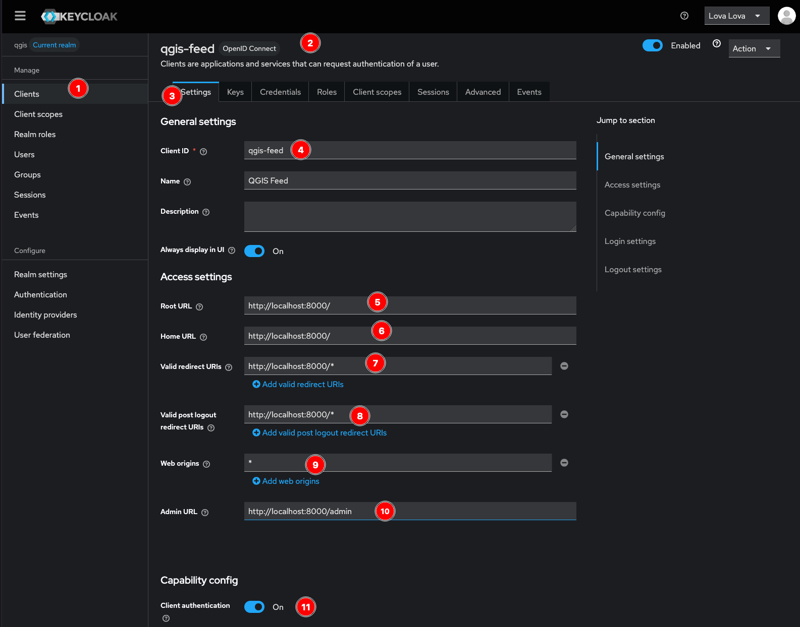

# NEED REVIEW

### **Keycloak Authentication Configuration**

See: https://www.nutfieldsecurity.com/posts/Implement-SSO-With-Keycloak 

#### **1. Access Keycloak Admin Console**
1. Navigate to `http://localhost:8081`
2. Log in with the admin credentials
3. Create a realm (e.g., `qgis`) 

4. Login tab parameters: TO DEFINE
5. Events: TO DEFINE
6. Email: Use Resend for the email Sending

---

#### **2. Configure OIDC Client for a Django App**
1. **Create Client**:
   - Go to *Clients* → *Create*
   **General Settings:**
   - Client ID: `django-app-name` (match your Django app name)
   - Client Protocol: `openid-connect`
   **Capability Config:**
   - Enable Client authentication and Standard flow
   **Login Settings:**
   - Root URL: `http://localhost:8000/`
   - Home URL: `http://localhost:8000/`
   - Valid Redirect URIs: `http://localhost:8000/*`
   - Valid post logout redirect URIs: `http://localhost:8000/*`
   - Web origins: *

2. **Credentials Tab**:
   - Note the `Client Secret` (needed for Django config)
   - Consider rotating secrets periodically
