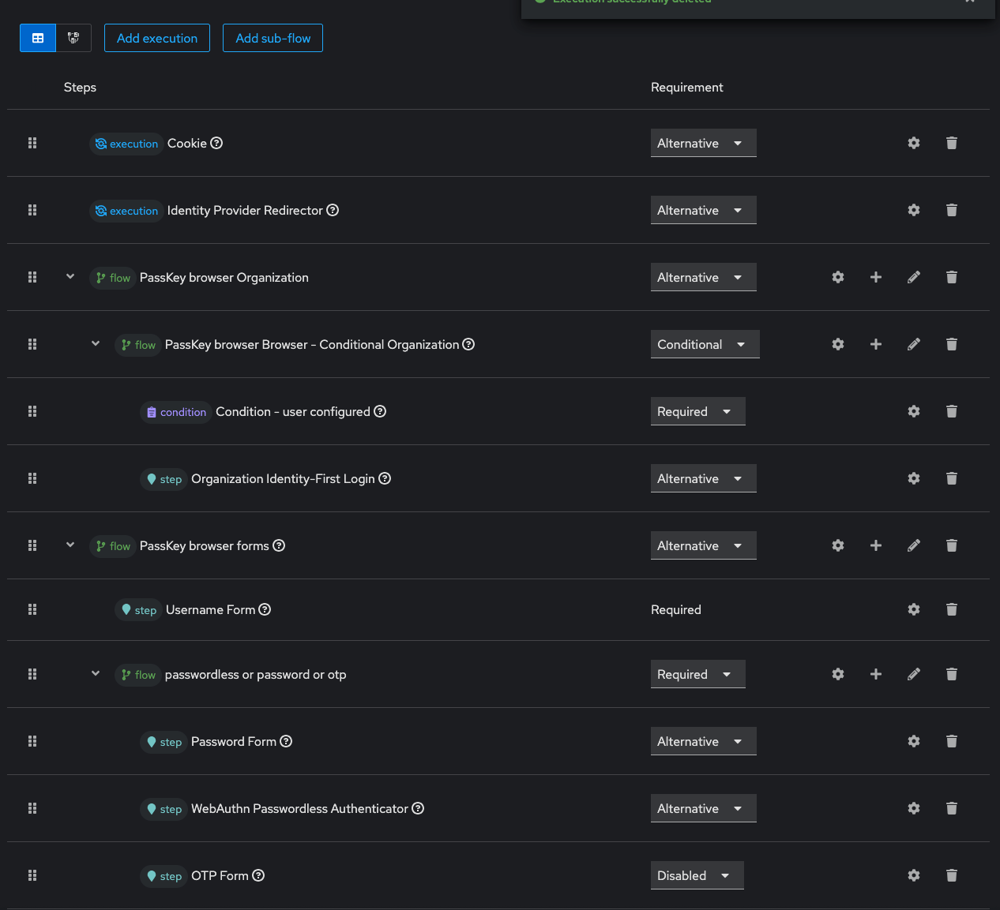
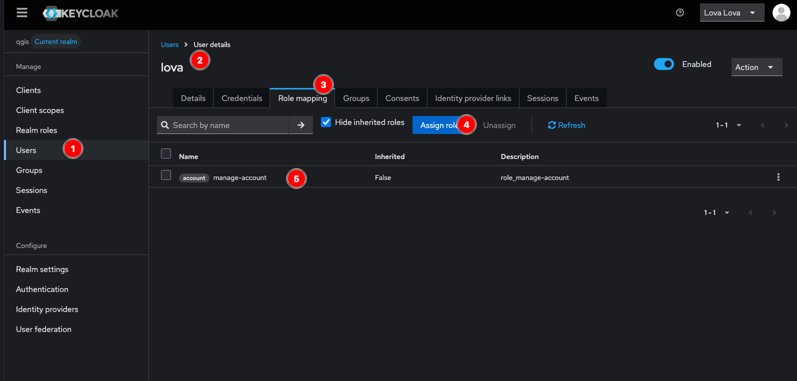

# Optional Passkey/webaut login

See https://blog.sparktour.me/en/posts/2024/01/24/add-passkey-webauth-otp-support-to-keycloak/

## Authentication flow

## Set users roles

TODO: Automate this process when migrating users

In order for users to set their passkeys correctly, each one should have access to their account management. For that, we need to add the `manage-account` role:

